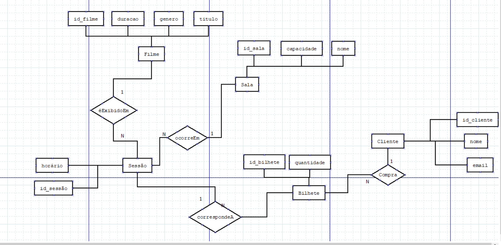

# Esquema Conceptual 

## Modelo E/A

   

## Regras de negócio adicionais (Restrições)

Estas regras definem comportamentos específicos do sistema que garantem a consistência dos dados e a viabilidade da operação do cinema:

Impossibilidade de Conflitos de Horário: O sistema deve impedir que duas sessões sejam marcadas na mesma sala ao mesmo tempo, garantindo que cada sessão ocorre num período distinto.

Controlo de Lotação Máxima: A soma da quantidade de todos os bilhetes vendidos para uma sessão não pode, em circunstância alguma, exceder a capacidade total da sala associada.

Unicidade do Registo de Cliente: Cada cliente deve ser identificado por um email único, impedindo a criação de contas duplicadas com o mesmo endereço eletrónico [rebd02.md].
Integridade do Domínio de Filmes: O género de cada filme deve pertencer obrigatoriamente a uma lista pré-definida (ex: 'Ação', 'Comédia', 'Drama'), implementada através de uma restrição ENUM.

Regra de Atribuição Livre de Lugares: O sistema não permite a escolha de filas ou números de assento específicos no ato da compra; a validação foca-se apenas na quantidade de lugares disponíveis na sala.

Dependência Funcional de Sessão: Uma sessão tem de estar obrigatoriamente ligada a um filme existente e a uma sala válida no momento da sua criação.

Consistência de Bilheteira: Não é permitida a venda de bilhetes com quantidade inferior a 1
.

[< Previous](rebd00.md) | [^ Main](/../../) | [Next >](rebd02.md)
:--- | :---: | ---: 